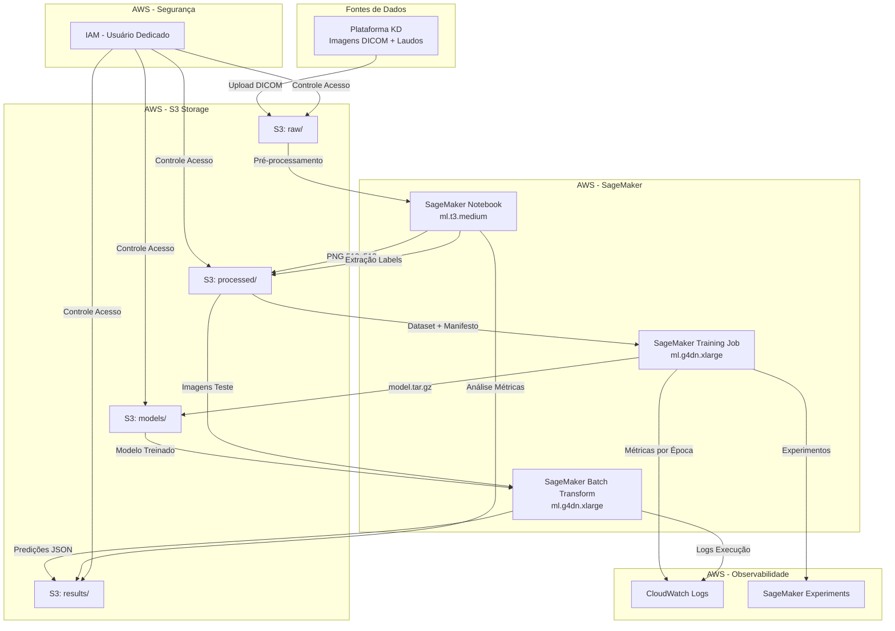
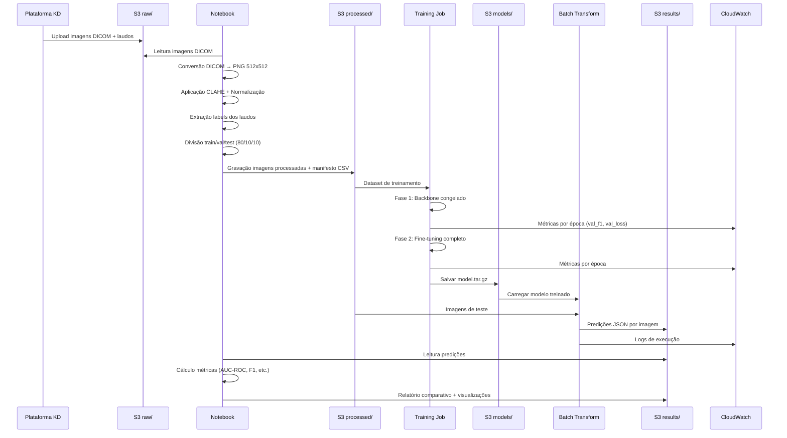

# Documento de Design: PoC IA Triagem de Radiografias de Tórax

## Overview

Este documento descreve o design técnico da Prova de Conceito (PoC) de Inteligência Artificial para triagem automática de radiografias de tórax para a KD Diagnósticos. O sistema utiliza modelos de visão computacional (ResNet50 e EfficientNet-B0) com transfer learning para classificar imagens em três níveis de prioridade: Normal (Azul), Suspeito (Amarelo) e Grave (Vermelho).

A arquitetura é inteiramente baseada em serviços gerenciados da AWS (S3, SageMaker, CloudWatch, IAM) na região us-east-1, com inferência em modo batch (sem endpoint real-time). O pipeline completo abrange desde a conversão de imagens DICOM até a geração de relatórios comparativos de métricas entre os modelos treinados.

O design prioriza reprodutibilidade, prevenção de data leakage e rastreabilidade de experimentos, requisitos fundamentais para validar a viabilidade tecnológica da solução em ambiente de pesquisa médica.

---

## Architecture

### Visão Geral do Sistema



### Fluxo de Dados Principal



---

## Components and Interfaces

### Componente 1: Pipeline de Pré-processamento

**Propósito**: Converter imagens DICOM brutas em formato padronizado para treinamento dos modelos.

**Interface**:

```python
class PipelinePreprocessamento:
    """Pipeline de conversão e normalização de imagens DICOM."""

    def __init__(self, config: PreprocessConfig) -> None: ...

    def processar_imagem(self, dicom_path: str) -> ProcessResult: ...

    def processar_lote(self, dicom_paths: list[str]) -> BatchResult: ...

    def gerar_relatorio(self, batch_result: BatchResult) -> RelatorioPre: ...
```

**Responsabilidades**:
- Decodificação de arquivos DICOM via pydicom
- Conversão para PNG escala de cinza 8-bit
- Redimensionamento para 512x512 com padding preservando proporção
- Aplicação de CLAHE (clip_limit=2.0, tile_grid=8x8)
- Normalização para [0, 1] em float32
- Tratamento de erros com continuidade do lote
- Geração de relatório com contagem de sucessos/falhas

---

### Componente 2: Extrator de Labels

**Propósito**: Extrair rótulos de classificação dos laudos estruturados utilizando correspondência de palavras-chave.

**Interface**:

```python
class ExtratorLabels:
    """Extração de rótulos a partir de laudos estruturados."""

    def __init__(self, keywords_config: KeywordsConfig) -> None: ...

    def classificar_laudo(self, texto_laudo: str) -> ClassificacaoResult: ...

    def agregar_exame(self, classificacoes: list[ClassificacaoResult]) -> ClassificacaoExame: ...

    def processar_lote(self, laudos: list[LaudoInput]) -> ExtractionBatchResult: ...
```

**Responsabilidades**:
- Busca case-insensitive de palavras-chave em laudos
- Classificação por severidade máxima (Grave > Suspeito > Normal)
- Agregação no nível do exame (max-severity entre imagens)
- Marcação de registros sem keywords como "revisão pendente"
- Rejeição de laudos com menos de 10 caracteres
- Geração de estatísticas de distribuição de classes

---

### Componente 3: Pipeline de Divisão de Dados

**Propósito**: Dividir o dataset em conjuntos de treinamento, validação e teste com prevenção de data leakage.

**Interface**:

```python
class PipelineDivisaoDados:
    """Divisão estratificada com prevenção de data leakage."""

    def __init__(self, config: SplitConfig) -> None: ...

    def dividir(self, dataset: DatasetCompleto) -> DataSplit: ...

    def verificar_leakage(self, split: DataSplit) -> LeakageReport: ...

    def exportar_manifesto(self, split: DataSplit, output_path: str) -> str: ...
```

**Responsabilidades**:
- Divisão 80/10/10 com seed fixa configurável
- Agrupamento por exam_id (group-based split)
- Estratificação por classe de diagnóstico (tolerância ±5pp)
- Verificação de interseção vazia entre conjuntos
- Alerta quando classe < 20 exemplos em val/test
- Exportação de manifesto CSV

---

### Componente 4: Pipeline de Treinamento

**Propósito**: Treinar modelos ResNet50 e EfficientNet-B0 com fine-tuning em duas etapas no SageMaker.

**Interface**:

```python
class PipelineTreinamento:
    """Treinamento de modelos com fine-tuning em duas etapas."""

    def __init__(self, config: TrainingConfig) -> None: ...

    def treinar_modelo(self, arquitetura: str, dataset_path: str) -> TrainingResult: ...

    def comparar_modelos(self, resultados: list[TrainingResult]) -> ComparacaoModelos: ...

    def registrar_melhor_modelo(self, comparacao: ComparacaoModelos) -> None: ...
```

**Responsabilidades**:
- Carregamento de modelos pré-treinados (ImageNet)
- Fase 1: Treinamento com backbone congelado
- Fase 2: Fine-tuning completo com LR reduzido (÷10)
- Registro de métricas no CloudWatch e SageMaker Experiments
- Salvamento de artefatos em model.tar.gz no S3
- Comparação entre arquiteturas por F1-score
- Detecção de divergência de loss (NaN por 3 épocas)

---

### Componente 5: Pipeline de Inferência (Batch Transform)

**Propósito**: Executar inferência em lote e calcular métricas de avaliação dos modelos.

**Interface**:

```python
class PipelineInferencia:
    """Inferência em lote e avaliação de performance."""

    def __init__(self, config: InferenceConfig) -> None: ...

    def executar_batch(self, model_path: str, data_path: str) -> BatchInferenceResult: ...

    def calcular_metricas(self, predictions: list[Prediction], ground_truth: list[str]) -> MetricasCompletas: ...

    def gerar_relatorio_comparativo(self, metricas: list[MetricasCompletas]) -> RelatorioComparativo: ...
```

**Responsabilidades**:
- Execução de Batch Transform com estratégia SingleRecord
- Geração de resultados JSON por imagem (classe, confiança, probabilidades)
- Cálculo de AUC-ROC (por classe e macro-average)
- Cálculo de F1-Score (weighted e macro)
- Cálculo de Precision/Recall por classe
- Geração de matriz de confusão 3x3
- Relatório comparativo entre modelos
- Salvamento em JSON e visualização PNG

---

## Data Models

### ImagemProcessada

```python
@dataclass
class ImagemProcessada:
    """Imagem após pré-processamento completo."""
    arquivo_origem: str          # Caminho DICOM original
    arquivo_destino: str         # Caminho PNG processado
    exam_id: str                 # Identificador do exame (para group split)
    patient_id: str              # Identificador do paciente
    resolucao_original: tuple[int, int]
    resolucao_final: tuple[int, int]  # Sempre (512, 512)
    padding_aplicado: bool
    clahe_aplicado: bool
    timestamp_processamento: str
```

**Regras de Validação**:
- `resolucao_final` deve ser sempre (512, 512)
- `arquivo_destino` deve ter extensão .png
- `exam_id` não pode ser vazio

### ClassificacaoResult

```python
@dataclass
class ClassificacaoResult:
    """Resultado da classificação de um laudo individual."""
    exam_id: str
    imagem_id: str
    classe: Literal["Normal", "Suspeito", "Grave"] | None
    status: Literal["classificado", "revisao_pendente", "rejeitado"]
    keywords_encontradas: list[str]
    motivo_rejeicao: str | None
```

**Regras de Validação**:
- Se `status == "classificado"`, `classe` não pode ser None
- Se `status == "rejeitado"`, `motivo_rejeicao` não pode ser None
- `keywords_encontradas` pode ser vazio apenas se `status != "classificado"`

### DataSplit

```python
@dataclass
class DataSplit:
    """Resultado da divisão de dados."""
    train: list[ImagemLabel]
    validation: list[ImagemLabel]
    test: list[ImagemLabel]
    seed: int
    proporcoes_reais: dict[str, dict[str, float]]  # conjunto → classe → proporção
    alertas: list[str]
    manifesto_path: str
```

**Regras de Validação**:
- Interseção de exam_ids entre conjuntos deve ser vazia
- Proporção de cada classe em cada conjunto deve estar dentro de ±5pp da proporção global
- `len(train) + len(validation) + len(test)` deve ser igual ao total do dataset

### Prediction

```python
@dataclass
class Prediction:
    """Resultado de inferência para uma imagem."""
    imagem_path: str
    predicted_class: Literal["Normal", "Suspeito", "Grave"]
    confidence: float           # Entre 0.0 e 1.0
    probabilities: dict[str, float]  # Soma = 1.0 (±1e-6)
    timestamp: str
```

**Regras de Validação**:
- `confidence` deve estar no intervalo [0.0, 1.0]
- `sum(probabilities.values())` deve ser 1.0 ± 1e-6
- `predicted_class` deve corresponder à classe com maior probabilidade
- `probabilities` deve conter exatamente 3 chaves: "Normal", "Suspeito", "Grave"

### TrainingConfig

```python
@dataclass
class TrainingConfig:
    """Configuração de treinamento."""
    arquitetura: Literal["resnet50", "efficientnet_b0"]
    epochs_fase1: int           # Backbone congelado (10 ou 15)
    epochs_fase2: int           # Fine-tuning completo
    learning_rate_fase1: float  # Ex: 1e-3
    learning_rate_fase2: float  # = learning_rate_fase1 / 10
    batch_size: int
    instance_type: str          # "ml.g4dn.xlarge"
    s3_output_path: str
    experiment_name: str
```

---

## Pseudocódigo Algorítmico

### Algoritmo 1: Pré-processamento de Imagem DICOM

```python
def processar_imagem_dicom(dicom_path: str, output_dir: str) -> ProcessResult:
    """
    Converte uma imagem DICOM para PNG 512x512 normalizado.
    
    Precondições:
        - dicom_path aponta para um arquivo existente
        - output_dir é um diretório com permissão de escrita
    
    Pós-condições:
        - Se sucesso: imagem PNG 512x512 salva em output_dir
        - Pixels normalizados em [0, 1] como float32
        - CLAHE aplicado com clip_limit=2.0, tile_grid=(8,8)
        - Se falha: log de erro registrado, ProcessResult com status="erro"
    """
    try:
        # Etapa 1: Decodificação DICOM
        ds = pydicom.dcmread(dicom_path)
        pixel_array = ds.pixel_array  # numpy array

        # Etapa 2: Conversão para escala de cinza 8-bit
        if pixel_array.dtype != np.uint8:
            pixel_array = normalize_to_uint8(pixel_array)

        # Etapa 3: Redimensionamento com padding
        h, w = pixel_array.shape
        target_size = 512
        scale = target_size / max(h, w)
        new_h, new_w = int(h * scale), int(w * scale)
        resized = cv2.resize(pixel_array, (new_w, new_h), interpolation=cv2.INTER_AREA)
        
        # Padding preto para manter 512x512
        canvas = np.zeros((target_size, target_size), dtype=np.uint8)
        y_offset = (target_size - new_h) // 2
        x_offset = (target_size - new_w) // 2
        canvas[y_offset:y_offset+new_h, x_offset:x_offset+new_w] = resized

        # Etapa 4: Aplicação CLAHE
        clahe = cv2.createCLAHE(clipLimit=2.0, tileGridSize=(8, 8))
        enhanced = clahe.apply(canvas)

        # Etapa 5: Normalização para [0, 1]
        normalized = enhanced.astype(np.float32) / 255.0

        # Etapa 6: Salvamento
        output_path = os.path.join(output_dir, gerar_nome_png(dicom_path))
        save_as_png(normalized, output_path)

        return ProcessResult(status="sucesso", output_path=output_path)

    except Exception as e:
        logger.error(f"Falha ao processar {dicom_path}: {str(e)}")
        return ProcessResult(status="erro", erro=str(e), arquivo=dicom_path)
```

---

### Algoritmo 2: Extração de Labels por Palavras-Chave

```python
# Listas de palavras-chave por categoria de severidade
KEYWORDS_GRAVE: list[str] = [
    "derrame pleural volumoso", "pneumotórax", "massa pulmonar",
    "consolidação extensa", "edema pulmonar", "cardiomegalia acentuada",
    "atelectasia total", "mediastino alargado", "fratura de costela",
    "hemotórax", "enfisema subcutâneo"
]

KEYWORDS_SUSPEITO: list[str] = [
    "opacidade", "infiltrado", "nódulo", "espessamento",
    "velamento", "hipotransparência", "derrame pleural pequeno",
    "cardiomegalia leve", "hiperinsuflação", "bronquiectasia",
    "atelectasia parcial", "desvio de traqueia"
]

KEYWORDS_NORMAL: list[str] = [
    "sem alterações", "normal", "exame dentro dos limites da normalidade",
    "campos pulmonares livres", "área cardíaca normal",
    "seios costofrênicos livres", "sem achados patológicos"
]


def classificar_laudo(texto_laudo: str) -> ClassificacaoResult:
    """
    Classifica um laudo por correspondência de palavras-chave.
    
    Precondições:
        - texto_laudo é uma string
    
    Pós-condições:
        - Se len(texto_laudo) < 10: status="rejeitado"
        - Se nenhuma keyword encontrada: status="revisao_pendente"
        - Se keywords encontradas: classe = max_severidade(keywords)
        - Severidade: Grave > Suspeito > Normal
    
    Invariante de Loop:
        - Em cada iteração, max_severidade contém a maior severidade
          encontrada até o momento entre todas as keywords verificadas
    """
    if len(texto_laudo.strip()) < 10:
        return ClassificacaoResult(
            classe=None,
            status="rejeitado",
            keywords_encontradas=[],
            motivo_rejeicao="Laudo insuficiente (< 10 caracteres)"
        )

    texto_lower = texto_laudo.lower()
    keywords_encontradas: list[str] = []
    max_severidade: int = -1  # -1=nenhuma, 0=Normal, 1=Suspeito, 2=Grave

    # Verificar keywords graves (severidade 2)
    for kw in KEYWORDS_GRAVE:
        if kw.lower() in texto_lower:
            keywords_encontradas.append(kw)
            max_severidade = max(max_severidade, 2)

    # Verificar keywords suspeitas (severidade 1)
    for kw in KEYWORDS_SUSPEITO:
        if kw.lower() in texto_lower:
            keywords_encontradas.append(kw)
            max_severidade = max(max_severidade, 1)

    # Verificar keywords normais (severidade 0)
    for kw in KEYWORDS_NORMAL:
        if kw.lower() in texto_lower:
            keywords_encontradas.append(kw)
            max_severidade = max(max_severidade, 0)

    if max_severidade == -1:
        return ClassificacaoResult(
            classe=None,
            status="revisao_pendente",
            keywords_encontradas=[],
            motivo_rejeicao=None
        )

    SEVERITY_MAP = {0: "Normal", 1: "Suspeito", 2: "Grave"}
    return ClassificacaoResult(
        classe=SEVERITY_MAP[max_severidade],
        status="classificado",
        keywords_encontradas=keywords_encontradas,
        motivo_rejeicao=None
    )
```

---

### Algoritmo 3: Divisão de Dados com Prevenção de Data Leakage

```python
def dividir_dataset(
    dataset: list[ImagemLabel],
    seed: int,
    train_ratio: float = 0.8,
    val_ratio: float = 0.1,
    test_ratio: float = 0.1
) -> DataSplit:
    """
    Divide dataset com group-based split e estratificação.
    
    Precondições:
        - train_ratio + val_ratio + test_ratio == 1.0
        - Cada item em dataset possui exam_id e classe válidos
        - seed é um inteiro para reprodutibilidade
    
    Pós-condições:
        - Nenhum exam_id aparece em mais de um conjunto
        - Proporção de cada classe em cada conjunto ±5pp da proporção global
        - Todas as imagens de um exame ficam no mesmo conjunto
    
    Invariante de Loop:
        - A cada exame atribuído, a interseção de exam_ids entre
          conjuntos permanece vazia
    """
    rng = np.random.default_rng(seed)

    # Agrupar imagens por exam_id
    exams: dict[str, list[ImagemLabel]] = {}
    for item in dataset:
        exams.setdefault(item.exam_id, []).append(item)

    # Determinar classe do exame (max-severity entre imagens)
    exam_classes: dict[str, str] = {}
    for exam_id, images in exams.items():
        severidades = [SEVERITY_ORDER[img.classe] for img in images]
        max_sev = max(severidades)
        exam_classes[exam_id] = SEVERITY_MAP[max_sev]

    # Estratificação por classe do exame
    exams_por_classe: dict[str, list[str]] = {"Normal": [], "Suspeito": [], "Grave": []}
    for exam_id, classe in exam_classes.items():
        exams_por_classe[classe].append(exam_id)

    train_exams, val_exams, test_exams = [], [], []

    for classe, exam_ids in exams_por_classe.items():
        rng.shuffle(exam_ids)
        n = len(exam_ids)
        n_train = int(n * train_ratio)
        n_val = int(n * val_ratio)

        train_exams.extend(exam_ids[:n_train])
        val_exams.extend(exam_ids[n_train:n_train + n_val])
        test_exams.extend(exam_ids[n_train + n_val:])

    # Verificação de integridade: interseção vazia
    train_set = set(train_exams)
    val_set = set(val_exams)
    test_set = set(test_exams)

    assert train_set & val_set == set(), "Data leakage detectado: train ∩ val"
    assert train_set & test_set == set(), "Data leakage detectado: train ∩ test"
    assert val_set & test_set == set(), "Data leakage detectado: val ∩ test"

    # Construir conjuntos de imagens
    train_images = [img for eid in train_exams for img in exams[eid]]
    val_images = [img for eid in val_exams for img in exams[eid]]
    test_images = [img for eid in test_exams for img in exams[eid]]

    # Verificar alertas de classes sub-representadas
    alertas = verificar_representacao_minima(val_images, test_images, min_count=20)

    return DataSplit(
        train=train_images,
        validation=val_images,
        test=test_images,
        seed=seed,
        proporcoes_reais=calcular_proporcoes(train_images, val_images, test_images),
        alertas=alertas,
        manifesto_path=""
    )
```

---

### Algoritmo 4: Treinamento em Duas Etapas (Fine-Tuning)

```python
def treinar_modelo_duas_etapas(config: TrainingConfig) -> TrainingResult:
    """
    Treina modelo com backbone congelado e depois fine-tuning completo.
    
    Precondições:
        - config.arquitetura in ["resnet50", "efficientnet_b0"]
        - Dataset de treinamento disponível no S3
        - Instância ml.g4dn.xlarge disponível
    
    Pós-condições:
        - Modelo treinado salvo em S3 como model.tar.gz
        - Métricas registradas no CloudWatch e SageMaker Experiments
        - Se divergência (loss NaN × 3 épocas): treinamento interrompido
    
    Invariante de Loop (por época):
        - Métricas de validação calculadas ao final de cada época
        - Melhor modelo (por val_f1) mantido em memória
    """
    # Carregar modelo pré-treinado
    model = carregar_modelo_pretrained(config.arquitetura, num_classes=3)

    # ═══════════════════════════════════════════
    # FASE 1: Backbone Congelado
    # ═══════════════════════════════════════════
    congelar_backbone(model)
    optimizer_fase1 = Adam(
        model.classifier_params(),
        lr=config.learning_rate_fase1
    )

    nan_count = 0
    melhor_f1 = 0.0

    for epoch in range(config.epochs_fase1):
        train_loss = treinar_epoca(model, train_loader, optimizer_fase1)
        val_metrics = avaliar(model, val_loader)

        # Verificar divergência
        if math.isnan(train_loss):
            nan_count += 1
            if nan_count >= 3:
                logger.error(f"Divergência detectada na época {epoch}")
                return TrainingResult(status="falha", motivo="loss_nan_3_epocas")
        else:
            nan_count = 0

        # Registrar métricas
        cloudwatch.put_metric("val_f1", val_metrics.f1, epoch)
        cloudwatch.put_metric("val_loss", val_metrics.loss, epoch)
        cloudwatch.put_metric("train_loss", train_loss, epoch)

        if val_metrics.f1 > melhor_f1:
            melhor_f1 = val_metrics.f1
            salvar_checkpoint(model, "melhor_fase1")

    # ═══════════════════════════════════════════
    # FASE 2: Fine-Tuning Completo
    # ═══════════════════════════════════════════
    descongelar_backbone(model)
    optimizer_fase2 = Adam(
        model.parameters(),
        lr=config.learning_rate_fase1 / 10  # LR reduzido por fator 10
    )

    nan_count = 0

    for epoch in range(config.epochs_fase2):
        train_loss = treinar_epoca(model, train_loader, optimizer_fase2)
        val_metrics = avaliar(model, val_loader)

        if math.isnan(train_loss):
            nan_count += 1
            if nan_count >= 3:
                logger.error(f"Divergência na fase 2, época {epoch}")
                return TrainingResult(status="falha", motivo="loss_nan_3_epocas")
        else:
            nan_count = 0

        cloudwatch.put_metric("val_f1", val_metrics.f1, epoch + config.epochs_fase1)
        cloudwatch.put_metric("val_loss", val_metrics.loss, epoch + config.epochs_fase1)
        cloudwatch.put_metric("train_loss", train_loss, epoch + config.epochs_fase1)

        if val_metrics.f1 > melhor_f1:
            melhor_f1 = val_metrics.f1
            salvar_checkpoint(model, "melhor_final")

    # Salvar artefatos finais
    salvar_model_tar_gz(model, config.s3_output_path)

    return TrainingResult(
        status="sucesso",
        melhor_f1=melhor_f1,
        arquitetura=config.arquitetura,
        artefato_s3=config.s3_output_path
    )
```

---

### Algoritmo 5: Cálculo de Métricas de Avaliação

```python
def calcular_metricas_completas(
    predictions: list[Prediction],
    ground_truth: list[str]
) -> MetricasCompletas:
    """
    Calcula todas as métricas de avaliação para um modelo.
    
    Precondições:
        - len(predictions) == len(ground_truth)
        - Todas as classes em ground_truth ∈ {"Normal", "Suspeito", "Grave"}
        - Cada prediction tem probabilities com soma = 1.0 (±1e-6)
    
    Pós-condições:
        - AUC-ROC por classe e macro-average ∈ [0.0, 1.0]
        - F1-Score weighted e macro ∈ [0.0, 1.0]
        - Precision e Recall por classe ∈ [0.0, 1.0]
        - Matriz de confusão 3x3 onde soma de cada linha = total da classe real
    """
    classes = ["Normal", "Suspeito", "Grave"]
    y_true = [classes.index(gt) for gt in ground_truth]
    y_pred = [classes.index(p.predicted_class) for p in predictions]
    y_proba = np.array([[p.probabilities[c] for c in classes] for p in predictions])

    # AUC-ROC por classe (One-vs-Rest)
    auc_por_classe = {}
    for i, classe in enumerate(classes):
        y_binary = [1 if y == i else 0 for y in y_true]
        auc_por_classe[classe] = roc_auc_score(y_binary, y_proba[:, i])

    auc_macro = np.mean(list(auc_por_classe.values()))

    # F1-Score
    f1_weighted = f1_score(y_true, y_pred, average="weighted")
    f1_macro = f1_score(y_true, y_pred, average="macro")

    # Precision e Recall por classe
    precision_por_classe = {}
    recall_por_classe = {}
    for i, classe in enumerate(classes):
        precision_por_classe[classe] = precision_score(y_true, y_pred, labels=[i], average="micro")
        recall_por_classe[classe] = recall_score(y_true, y_pred, labels=[i], average="micro")

    # Matriz de confusão
    cm = confusion_matrix(y_true, y_pred, labels=[0, 1, 2])
    # Verificação: soma de cada linha = total da classe
    assert all(cm[i].sum() == sum(1 for y in y_true if y == i) for i in range(3))

    return MetricasCompletas(
        auc_roc_por_classe=auc_por_classe,
        auc_roc_macro=auc_macro,
        f1_weighted=f1_weighted,
        f1_macro=f1_macro,
        precision_por_classe=precision_por_classe,
        recall_por_classe=recall_por_classe,
        matriz_confusao=cm.tolist()
    )
```

---

## Funções-Chave com Especificações Formais

### Função: normalize_to_uint8()

```python
def normalize_to_uint8(pixel_array: np.ndarray) -> np.ndarray:
    """Normaliza array de pixels para uint8 (0-255)."""
```

**Precondições:**
- `pixel_array` é um numpy array 2D (escala de cinza)
- `pixel_array` possui pelo menos 1 elemento

**Pós-condições:**
- Retorno tem dtype = np.uint8
- Valores no intervalo [0, 255]
- Preserva a relação de ordem dos pixels originais
- Se `pixel_array.max() == pixel_array.min()`: retorno é array de zeros

---

### Função: congelar_backbone()

```python
def congelar_backbone(model: nn.Module) -> None:
    """Congela parâmetros do backbone, deixando apenas classificador treinável."""
```

**Precondições:**
- `model` é um modelo PyTorch com atributo `backbone` e `classifier`
- `model` está em modo de treinamento

**Pós-condições:**
- Todos os parâmetros de `model.backbone` têm `requires_grad = False`
- Todos os parâmetros de `model.classifier` têm `requires_grad = True`
- Nenhum peso é modificado (apenas gradientes são controlados)

---

### Função: verificar_leakage()

```python
def verificar_leakage(split: DataSplit) -> LeakageReport:
    """Verifica integridade da divisão de dados."""
```

**Precondições:**
- `split` contém conjuntos train, validation e test não-vazios
- Cada item possui `exam_id` válido

**Pós-condições:**
- Se interseção vazia: `report.leakage_detectado = False`
- Se interseção não-vazia: `report.leakage_detectado = True` com IDs duplicados listados
- Execução interrompida com exceção se leakage detectado

---

### Função: aplicar_augmentation()

```python
def aplicar_augmentation(image: np.ndarray, conjunto: str) -> np.ndarray:
    """Aplica data augmentation apenas no conjunto de treinamento."""
```

**Precondições:**
- `image` é um array numpy normalizado [0, 1] com shape (512, 512)
- `conjunto` ∈ {"train", "validation", "test"}

**Pós-condições:**
- Se `conjunto == "train"`: transformações estocásticas aplicadas (flip, rotação, brilho)
- Se `conjunto in {"validation", "test"}`: apenas redimensionamento e normalização (determinístico)
- Saída mantém shape (512, 512) e valores em [0, 1]

**Invariante:**
- Imagens de validação e teste nunca recebem augmentation estocástica

---

## Uso de Exemplo

### Execução Completa do Pipeline

```python
# ═══════════════════════════════════════════════════════════
# Exemplo: Execução end-to-end do pipeline da PoC
# ═══════════════════════════════════════════════════════════

import boto3
from sagemaker import Session
from sagemaker.pytorch import PyTorch
from sagemaker.transformer import Transformer

# --- Configuração ---
BUCKET = "kd-diagnosticos-poc"
REGION = "us-east-1"
SEED = 42

# --- Pré-processamento ---
pipeline_pre = PipelinePreprocessamento(
    config=PreprocessConfig(
        target_size=512,
        clahe_clip_limit=2.0,
        clahe_tile_grid=(8, 8),
        output_format="png"
    )
)

dicom_files = listar_arquivos_s3(f"s3://{BUCKET}/raw/", extensao=".dcm")
batch_result = pipeline_pre.processar_lote(dicom_files)
relatorio = pipeline_pre.gerar_relatorio(batch_result)
print(f"Processadas: {relatorio.sucesso}/{relatorio.total} | Falhas: {relatorio.falhas}")

# --- Extração de Labels ---
extrator = ExtratorLabels(keywords_config=KeywordsConfig.default())
laudos = carregar_laudos_s3(f"s3://{BUCKET}/raw/laudos/")
labels_result = extrator.processar_lote(laudos)
print(f"Classificados: {labels_result.classificados} | Pendentes: {labels_result.pendentes}")

# --- Divisão de Dados ---
divisor = PipelineDivisaoDados(config=SplitConfig(seed=SEED))
dataset = montar_dataset(batch_result.imagens_sucesso, labels_result.labels)
split = divisor.dividir(dataset)
divisor.verificar_leakage(split)
manifesto = divisor.exportar_manifesto(split, f"s3://{BUCKET}/processed/manifesto.csv")
print(f"Train: {len(split.train)} | Val: {len(split.validation)} | Test: {len(split.test)}")

# --- Treinamento (SageMaker Training Job) ---
for arquitetura in ["resnet50", "efficientnet_b0"]:
    estimator = PyTorch(
        entry_point="train.py",
        role="arn:aws:iam::ACCOUNT:role/SageMakerRole",
        instance_type="ml.g4dn.xlarge",
        instance_count=1,
        framework_version="2.0",
        py_version="py310",
        hyperparameters={
            "arquitetura": arquitetura,
            "epochs_fase1": 10 if arquitetura == "resnet50" else 15,
            "epochs_fase2": 20,
            "lr_fase1": 1e-3,
            "batch_size": 32,
            "seed": SEED,
        },
        metric_definitions=[
            {"Name": "val_f1", "Regex": "val_f1: ([0-9\\.]+)"},
            {"Name": "val_loss", "Regex": "val_loss: ([0-9\\.]+)"},
            {"Name": "train_loss", "Regex": "train_loss: ([0-9\\.]+)"},
        ],
    )
    estimator.fit({
        "train": f"s3://{BUCKET}/processed/train/",
        "validation": f"s3://{BUCKET}/processed/validation/",
    })

# --- Inferência em Lote (Batch Transform) ---
transformer = Transformer(
    model_name=melhor_modelo.name,
    instance_type="ml.g4dn.xlarge",
    instance_count=1,
    strategy="SingleRecord",
    max_payload=6,
    output_path=f"s3://{BUCKET}/results/",
)
transformer.transform(
    data=f"s3://{BUCKET}/processed/test/",
    content_type="image/png",
)
transformer.wait()

# --- Avaliação ---
pipeline_inf = PipelineInferencia(config=InferenceConfig())
metricas = pipeline_inf.calcular_metricas(predictions, ground_truth)
print(f"AUC-ROC Macro: {metricas.auc_roc_macro:.4f}")
print(f"F1 Weighted: {metricas.f1_weighted:.4f}")
```

---

## Correctness Properties

### Property 1: Integridade do Pré-processamento

**Validates: Requirements 1.1, 1.2, 1.3, 1.4**

Para toda imagem DICOM processada com sucesso pelo Pipeline_Preprocessamento, a imagem de saída deve ter dimensões 512x512, tipo float32, e valores de pixel no intervalo [0.0, 1.0].

```python
# Para toda imagem processada com sucesso:
assert output_image.shape == (512, 512)
assert output_image.dtype == np.float32
assert 0.0 <= output_image.min() and output_image.max() <= 1.0
```

### Property 2: Exclusividade de Classificação

**Validates: Requirements 5.1, 5.2, 5.3**

Para toda classificação realizada pelo Sistema_Classificacao, o resultado deve conter exatamente uma classe predita entre {Normal, Suspeito, Grave}, probabilidades que somam 1.0, e a classe predita deve ser a de maior probabilidade.

```python
# Para toda classificação realizada:
assert classification.classe in {"Normal", "Suspeito", "Grave"}
assert sum(classification.probabilities.values()) == pytest.approx(1.0, abs=1e-6)
assert classification.predicted_class == max(
    classification.probabilities, key=classification.probabilities.get
)
```

### Property 3: Prevenção de Data Leakage

**Validates: Requirements 8.1, 8.2, 8.3**

Para toda divisão de dados realizada pelo Pipeline_Treinamento, a interseção de identificadores de exame entre quaisquer dois conjuntos (train, validation, test) deve ser vazia.

```python
# Para toda divisão de dados:
train_ids = {img.exam_id for img in split.train}
val_ids = {img.exam_id for img in split.validation}
test_ids = {img.exam_id for img in split.test}
assert train_ids & val_ids == set()
assert train_ids & test_ids == set()
assert val_ids & test_ids == set()
```

### Property 4: Severidade Máxima na Extração de Labels

**Validates: Requirements 2.1, 2.5**

Para todo laudo contendo palavras-chave de múltiplas categorias de severidade, o Extrator_Labels deve atribuir a categoria de maior gravidade (Grave > Suspeito > Normal) como rótulo final.

```python
# Para todo laudo com múltiplas keywords de categorias diferentes:
SEVERITY = {"Normal": 0, "Suspeito": 1, "Grave": 2}
keywords_severidades = [SEVERITY[categoria(kw)] for kw in keywords_encontradas]
assert SEVERITY[resultado.classe] == max(keywords_severidades)
```

### Property 5: Reprodutibilidade da Divisão

**Validates: Requirements 3.1**

Para o mesmo dataset e a mesma seed, o Pipeline_Treinamento deve sempre produzir exatamente a mesma divisão de dados entre treinamento, validação e teste.

```python
# A mesma seed sempre produz a mesma divisão:
split_1 = dividir_dataset(dataset, seed=42)
split_2 = dividir_dataset(dataset, seed=42)
assert split_1.train == split_2.train
assert split_1.validation == split_2.validation
assert split_1.test == split_2.test
```

### Property 6: Augmentation Exclusiva para Treinamento

**Validates: Requirements 8.4, 8.5**

Para toda imagem nos conjuntos de validação ou teste, apenas transformações determinísticas (redimensionamento e normalização) devem ser aplicadas, sem qualquer augmentation estocástica.

```python
# Imagens de validação e teste nunca são augmentadas:
for img in split.validation + split.test:
    transformada = aplicar_augmentation(img.pixels, img.conjunto)
    assert transformada == aplicar_augmentation(img.pixels, img.conjunto)  # Determinístico
```

### Property 7: Consistência da Matriz de Confusão

**Validates: Requirements 7.4**

Para toda matriz de confusão gerada, a soma de cada linha deve ser igual ao total de amostras da respectiva classe real no dataset de teste.

```python
# Cada linha soma o total de amostras da classe real:
for i, classe in enumerate(["Normal", "Suspeito", "Grave"]):
    total_classe = sum(1 for gt in ground_truth if gt == classe)
    assert sum(matriz_confusao[i]) == total_classe
```

---

## Error Handling

### Erro 1: Falha na Decodificação DICOM

**Condição**: Arquivo DICOM corrompido, cabeçalho ausente ou dados de pixel inválidos
**Resposta**: Registrar erro em log (nome do arquivo + descrição da falha), continuar processamento das demais imagens
**Recuperação**: Imagem é excluída do dataset; relatório final indica quantidade de falhas

### Erro 2: Divergência de Loss no Treinamento

**Condição**: Loss = NaN por 3 épocas consecutivas
**Resposta**: Interromper treinamento do modelo afetado, registrar erro no CloudWatch
**Recuperação**: Prosseguir com treinamento dos demais modelos; resultado parcial é salvo

### Erro 3: Imagem Excede Tamanho Máximo (Batch Transform)

**Condição**: Imagem PNG > 6 MB de payload
**Resposta**: Ignorar imagem, registrar aviso no CloudWatch com nome do arquivo
**Recuperação**: Demais imagens são processadas normalmente

### Erro 4: Data Leakage Detectado

**Condição**: Identificador de exame presente em mais de um conjunto (train/val/test)
**Resposta**: Interromper execução imediatamente com mensagem de erro indicando IDs duplicados
**Recuperação**: Requer correção manual da lógica de divisão antes de re-executar

### Erro 5: Classe Sub-representada

**Condição**: Menos de 20 exemplos de uma classe no conjunto de validação ou teste
**Resposta**: Emitir alerta com nome da classe, conjunto afetado e quantidade encontrada
**Recuperação**: Continuar execução normalmente; alerta é informativo para decisão humana

### Erro 6: Falha no Batch Transform Job

**Condição**: Erro de infraestrutura ou timeout no job do SageMaker
**Resposta**: Registrar no CloudWatch: ID do job, timestamp, motivo da falha
**Recuperação**: Permite re-execução do job após investigação do erro

---

## Testing Strategy

### Testes Unitários

| Componente | Cenários de Teste |
|---|---|
| PipelinePreprocessamento | DICOM válido → PNG 512x512; DICOM corrompido → erro gracioso; imagem não-quadrada → padding correto |
| ExtratorLabels | Laudo com keyword grave → classe Grave; laudo vazio → rejeitado; múltiplas categorias → max severity |
| PipelineDivisaoDados | Split reprodutível com mesma seed; sem leakage entre conjuntos; estratificação dentro de ±5pp |
| Normalização | Pixels [0, 1] após CLAHE; uint8 intermediário correto |

### Testes de Propriedade (Property-Based Testing)

**Biblioteca**: Hypothesis (Python)

```python
from hypothesis import given, strategies as st

@given(st.binary(min_size=100, max_size=10000))
def test_extrator_nunca_retorna_classe_invalida(texto):
    """Qualquer texto produz classe válida ou status não-classificado."""
    result = classificar_laudo(texto.decode("utf-8", errors="ignore"))
    assert result.classe in {"Normal", "Suspeito", "Grave", None}
    assert result.status in {"classificado", "revisao_pendente", "rejeitado"}

@given(st.lists(st.sampled_from(["Normal", "Suspeito", "Grave"]), min_size=1, max_size=10))
def test_agregacao_exame_sempre_max_severity(classes):
    """Agregação de exame sempre retorna a maior severidade."""
    resultado = agregar_exame(classes)
    SEVERITY = {"Normal": 0, "Suspeito": 1, "Grave": 2}
    assert SEVERITY[resultado] == max(SEVERITY[c] for c in classes)

@given(st.integers(min_value=0, max_value=2**32))
def test_divisao_sempre_sem_leakage(seed):
    """Qualquer seed produz divisão sem leakage."""
    split = dividir_dataset(DATASET_FIXTURE, seed=seed)
    train_ids = {img.exam_id for img in split.train}
    val_ids = {img.exam_id for img in split.validation}
    test_ids = {img.exam_id for img in split.test}
    assert train_ids & val_ids == set()
    assert train_ids & test_ids == set()
```

### Testes de Integração

| Cenário | Validação |
|---|---|
| Pipeline end-to-end (10 imagens) | DICOM → PNG → Label → Split → Treinamento (1 epoch) → Predição |
| SageMaker Training Job (mock) | Verifica formato model.tar.gz, presença de métricas no CloudWatch |
| Batch Transform (dataset pequeno) | Verifica formato JSON de saída, consistency das probabilidades |

---

## Considerações de Performance

### Treinamento
- **Instância**: ml.g4dn.xlarge (1× NVIDIA T4, 16 GB VRAM)
- **Batch size**: 32 imagens (otimizado para 16 GB VRAM com imagens 512x512)
- **Mixed precision**: Utilizar AMP (Automatic Mixed Precision) para acelerar treinamento em ~30%
- **Data loading**: Prefetch com 4 workers para evitar gargalo de I/O

### Pré-processamento
- **Paralelismo**: Processar imagens DICOM com multiprocessing (pool de 4 workers)
- **Memória**: Processar em lotes de 100 imagens para evitar OOM
- **I/O**: Upload para S3 com multipart upload para arquivos > 5 MB

### Inferência (Batch Transform)
- **Estratégia**: SingleRecord para simplicidade e debugging
- **Throughput estimado**: ~2-3 segundos por imagem no ml.g4dn.xlarge
- **Total**: ~4000 imagens × 3s ≈ 3.3 horas (compatível com estimativa de 4h)

---

## Considerações de Segurança

### Controle de Acesso (IAM)
- Usuário IAM dedicado com política de menor privilégio
- Permissões restritas: S3 (GetObject, PutObject nos buckets do projeto), SageMaker (jobs e notebooks), CloudWatch (logs)
- MFA obrigatório na conta AWS
- Credenciais desativáveis ao final da PoC sem impacto em outros recursos

### Proteção de Dados
- Criptografia em repouso: SSE-S3 em todos os buckets
- Buckets com Block Public Access habilitado
- Dados de pacientes: imagens devem ser anonimizadas antes do upload (remover metadados DICOM identificáveis)
- Região us-east-1 (premissa de custo; para produção, avaliar sa-east-1 por LGPD)

### Organização S3
```
s3://kd-diagnosticos-poc/
├── raw/            # Imagens DICOM originais + laudos
├── processed/      # PNG 512x512 normalizados + manifesto
├── models/         # Artefatos model.tar.gz
└── results/        # Predições JSON + relatórios de métricas
```

---

## Dependências

### Bibliotecas Python (Ambiente SageMaker)

| Biblioteca | Versão | Propósito |
|---|---|---|
| PyTorch | ≥ 2.0 | Framework de deep learning |
| torchvision | ≥ 0.15 | Modelos pré-treinados (ResNet50, EfficientNet-B0) |
| pydicom | ≥ 2.4 | Leitura de arquivos DICOM |
| opencv-python | ≥ 4.8 | CLAHE, redimensionamento, manipulação de imagem |
| numpy | ≥ 1.24 | Operações numéricas |
| pandas | ≥ 2.0 | Manipulação de dados tabulares |
| scikit-learn | ≥ 1.3 | Métricas (AUC-ROC, F1, confusion matrix), split |
| matplotlib | ≥ 3.7 | Visualizações (confusion matrix, curvas ROC) |
| boto3 | ≥ 1.28 | SDK AWS (S3, CloudWatch) |
| sagemaker | ≥ 2.170 | SDK SageMaker (Training, Transform) |
| hypothesis | ≥ 6.80 | Testes baseados em propriedades |

### Serviços AWS

| Serviço | Configuração | Propósito |
|---|---|---|
| Amazon S3 | Standard, 70 GB, SSE-S3 | Armazenamento de dados e artefatos |
| SageMaker Notebook | ml.t3.medium, 160h/mês | Desenvolvimento e experimentação |
| SageMaker Training | ml.g4dn.xlarge, ~20h total | Treinamento de modelos |
| SageMaker Batch Transform | ml.g4dn.xlarge, ~4h total | Inferência em lote |
| Amazon CloudWatch | 5 GB logs | Monitoramento e debugging |
| AWS IAM | Usuário dedicado + MFA | Controle de acesso |
